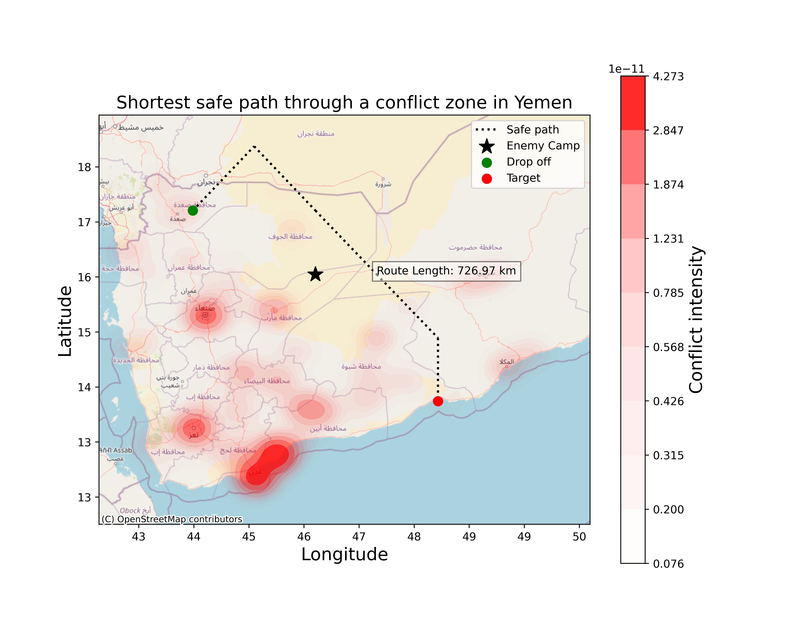

# Safe-path-mapping-using-Dijkstras-algorithm

### Problem Statement:
Navigating through conflict zones poses significant risks and challenges. The danger of moving through these zones requires careful planning to find quick yet safe routes. Simplistic assessments of conflict intensity and geography can be misleading, leading to routes that may appear efficient but fail to account for the actual risks on the ground. This project aims to develop a method that not only finds the quickest route but also incorporates risk factors like the likelihood of attacks.

### Dataset:
This project uses the Cities and Armed Conflict Events (CACE) dataset, which provides real historical conflict data from Yemen spanning the years 2020 to 2023.

### Methodology:

Data Preparation: Geospatial data from CACE is processed to identify conflict zones. Coordinates are rounded to a coarse scale for simplification.

Pathfinding Algorithm: I employ Dijkstra's algorithm, a classic approach in computational geography, to determine the shortest path. This algorithm is modified to factor in the intensity of conflicts at various locations.

Visualization: The results are visualized using Python libraries Matplotlib and Seaborn.

### Limitations:
My analysis is simplified and does not account for several critical real-world factors:

**Topography and natural barriers**: Factors like elevation changes, water bodies, and other natural features are not considered.

**Man-made structures**: The presence of roads, bridges, and urban areas, which significantly affect movement, are not included in the analysis.

**DynamicnNature of conflicts**: The fluid situation on the ground, with rapidly changing safe and unsafe areas, is beyond the scope of this analysis.

### Results:

**Figure 1** Optimized route through conflict zones, avoiding enemy bases. The heatmap indicates conflict intensity, and the black dotted line shows the safest path calculated.
